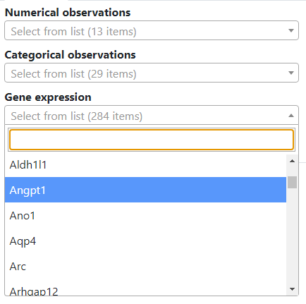

# AnnData Handling in TissUUmaps

To visualize and manipulate annotated data matrices, TissUUmaps leverages the capabilities of the **AnnData** (Annotated Data) Python package, stored in the h5ad format. AnnData provides a flexible and efficient framework for working with annotated data in memory and on disk, bridging the functionality of pandas and xarray. Notable features of AnnData include support for sparse data, lazy operations, and a PyTorch interface.

## Loading AnnData Objects

You can load AnnData objects in the same way as you would load TissUUmaps projects or images, by dragging and dropping the file into the TissUUmaps interface. TissUUmaps will automatically detect the file type and load the AnnData object into the interface. You can also load AnnData objects by clicking on the "Open" button in the "File" menu and selecting the file from your computer.

## AnnData Specification in TissUUmaps

TissUUmaps adheres to the specifications defined by the SCVerse community for AnnData objects. TissUUmaps can load AnnData objects stored in the HDF5 format.

The key components of the AnnData structure in TissUUmaps are as follows:

### Spatial Coordinates

Spatial coordinates are crucial for spatial omics analysis. In TissUUmaps, these coordinates are stored as a 2-column matrix in one of the following locations:
- `/obsm/spatial`
- `/obsm/X_spatial`
- `/obsm/X_umap`
- `/obsm/tSNE`
- `/obsm/UMAP`

### Observations

Observations are stored in the `/obs` section of the AnnData object. This section contains information related to individual observations.

### Gene Expressions

Gene expressions are stored in the `X` section of the AnnData object. It's important to note that the gene expression matrix should be in sparse Compressed Sparse Column (CSC) format. If the matrix is not in CSC format, TissUUmaps will create a new AnnData object with the gene expression matrix in CSC sparse format.

### Variable Information

Variable information is stored in the `/var` section of the AnnData object.

### Image Loading

TissUUmaps is equipped to load images stored in the following location:
- `/uns/spatial/{library_id}/images/hires`

Here, `{library_id}` is an observation column obtained from `/obs/library_id`. Additionally, TissUUmaps utilizes a scale factor from `/uns/spatial/{library_id}/scalefactors/tissue_hires_scalef`.

## Dropdowns

Once loaded into TissUUmaps, each observation is accessible through dropdown menus. There are separate dropdowns for numerical and categorical observations, providing a convenient interface for users to explore and analyze their spatial omics data.

The gene expression dropdown menu contains the X matrix.

## Example

Here is an example of the TissUUmaps interface when loading an AnnData object with three samples. The dropdown menus are populated with the observations from the AnnData object. Here, the "celltype_annotation" is selected.

