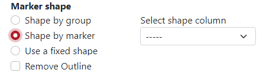
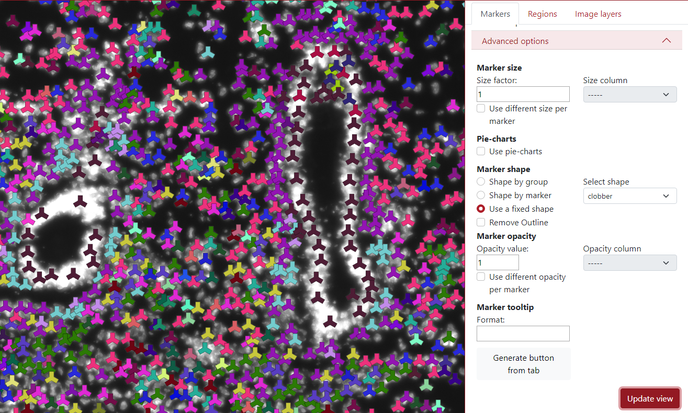
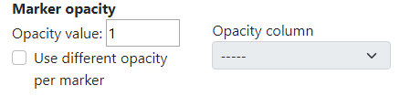

# Markers

## Supported marker format

TissUUmaps can read CSV (Comma Separated Values) files with a header row, and at least spatial coordinate columns (X and Y). CSV files are not limited in the number of columns or number of rows. Other columns can contain information for displaying markers (key to group markers, color, size, shape, piecharts, etc.)

CSV files can be exported from any spreadsheet program, or any programming language (Python, R, etc.)

## Load markers
You can load the markers when you select the *Markers* tab and click the button + as you can see in the figure below. You can click the plus several times to load various marker files.

You can also load markers directly using drag and drop from a File Explorer if you are using the TissUUmaps GUI.

## Markers settings
Before the markers are displayed you have to set up the markers settings.

### File and coordinates
The first step is to select the desired file from your computer under the tab *File and coordinates - Choose file*.

You can change the *Tab name* to the desired name, so it is easier to navigate between them when there are more tabs.

The next step is to select the column names from the .csv file corresponding to the X and Y coordinates.

### Render options
Here, you can define a *key to group by*, what is a column from the .csv file which will be used to display the dataset grouped by different colors and shapes of the markers. In this example, we use the column *genes*, where different colors and shapes of markers represent different genes.

There is an option to display an extra column, for example when the data are clustered but you want to see the original genes and also the cluster names.

In *Color options*, you can select to color by groups where each group has a different color. Then on the right side, you can select the color palette:
* Key value - Colors are generated from the name of the group (first 4 letters). Groups starting with the same letter have similar colors.
* Randomly - Colors are generated randomly.
* Dictionary - you can insert a specific dictionary in the text area which will be used for generating the colors.

If you want to *color by markers*, you have to select the column from the .csv file which will be used to create the colors, and the colormap, but only if the color column is numeral.

### Advanced options

TissUUmaps tool contains also advanced options when working with the data. The first one is adjustable marker size. This is usually done in the right upper corner of the visualization panel. However, in the advanced setting, the user can change the size factor of the slider to any value.

Additionally, there can be used a different size per marker based on a selected column. In the example below, I  chose column *counts* which represents the number of counts in that cell (marker). This means that a larger marker represents a cell that contains more counts in it.

Another advanced option is the choice to display markers as pie-charts, it can represent the probability of that marker belonging to different groups. The user needs to select the *pie-chart column*, which contains mentioned probabilities for all the markers. All the probabilities for that specific marker need to be in a row divided by a semicolon.

In the example below the pie-charts represent the probability of the marker being of each cell type. In the left upper corner can be seen the legend of the cell types. By default, there are only 10 colors so the colors are used in the loop. This can be changed by using pie-chart colors from a dictionary.

The shape of the markers can also be changed. By default, it is set up to be selected by the group, which means that each group has a different marker shape chosen from the list of shapes iteratively. The user can also pre-define the shapes from the dictionary to ensure visualization robustness in different sessions.

In the example below each group has specific color as well as a specific marker shape.

Another option for the marker shape is *shape by marker*. Here, the user needs to select a column with category values, and each category is used for a different shape.

In the example below, the selected column is ARIH1, which contains 10 categories, so you can see that there are 10 shapes in the visualization.

The third option in the marker shape is to *use a fixed shape*. This can be used if the user is not happy with all the different marker shapes and wants to make it homogeneous.

In the example below, the selected shape is a clobber and you can see that all the markers are in the shape of a clobber.

The last option in the marker shape is to *remove outline*. This can be used to remove the dark outline of markers.

The next advanced option is *marker opacity* which is adjustable. The user can change the opacity in order to display things underneath.

In the example below, the opacity value was set to 0.6 which made the markers a bit transparent.

In the example below, we checked *use different opacity per marker*. The user needs to select opacity column which will be used for displaying different opacities in markers.

The next option is the *marker tooltip*, which is the text which is displayed when the user clicks on the marker. By default, it displayed the key group the marker belongs to.

As you can see in the example below, the green marker we clicked on belongs to the cell type Proliferating epithelial 2.

However, this can be modified by writing text into the text area. In this example, we wrote {tab} - {key} - {col_counts}. *{tab}* represents the tab name that we set when we loaded the markers, *{key}* represents the key group to which the marker belongs and *{col_counts}* represents the value of that marker in the column called counts. The word counts can be replaced by any column name in order to display it on the tooltip.

In the example below, the green dot which we clicked on is from the tab Cell types, belongs to the cell type Proliferating epithelial 2 and it has 127 counts in it.

The last advanced option is the button *Generate button from tab*. This button incorporates all the display settings the user set up into a single button.

The user can choose the relative path to the csv file, button inner text and comment which will be displayed next to the button.

In the example below, you can see the generated button *Download data* placed on the top of the tabs panel. On the right of the button is placed text *My settings*.

### Table of markers

When the markers are loaded, a table of markers will appear in order to interact with the marker. Each row represents a group of markers with a specific color and shape. In the figure below, column *A)* represents if a specific row of markers is displayed or not, the second column *B)* represents the list of groups, the third column *C)* represents group counts, the fourth column *D)* represents the shape of the group markers, the fifth column *E)* represents the color of the group markers and the sixth column *F)* can display specific group when the cursor is on the eye icon.

If the check box is checked - the group is displayed, if the check box is unchecked - the group is not displayed. In the example below, we checked two groups of cell types: Airway Fibroblast and Airway smooth muscle, and only these two groups are displayed on the left visualization panel. The first checkbox *All* ensures displaying of all the markers.

In the fourth column *Shape*, the user can select which shape is preferred for each marker group. In the figure below, there is a list of 14 different shapes which can be used.

In the fifth column *Color*, the user can select which color is preferred for each marker group. In the figure below, it is possible to choose from some list of basic colors, select a specific color by the cursor from the palette and also use numbers to generate color, either RGB, HSV, or HTML.

In the example below can be seen that if the cursor is placed on the eye icon in the row Airway fibroblast, only markers of this group are displayed on the visualization panel.

