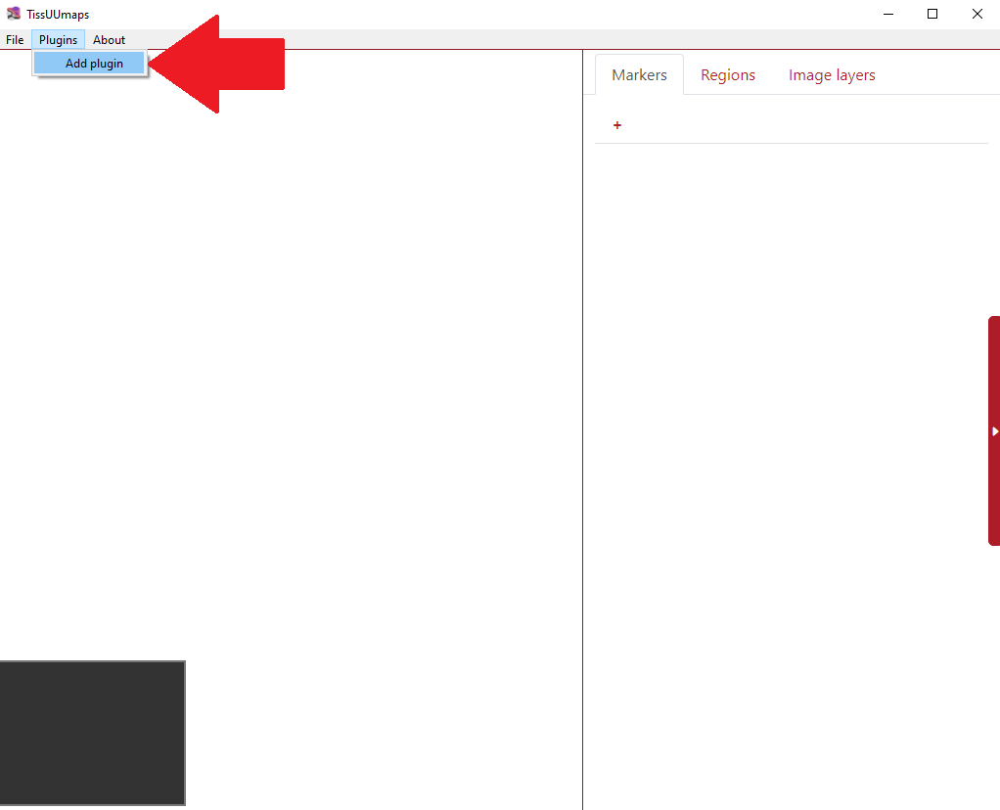
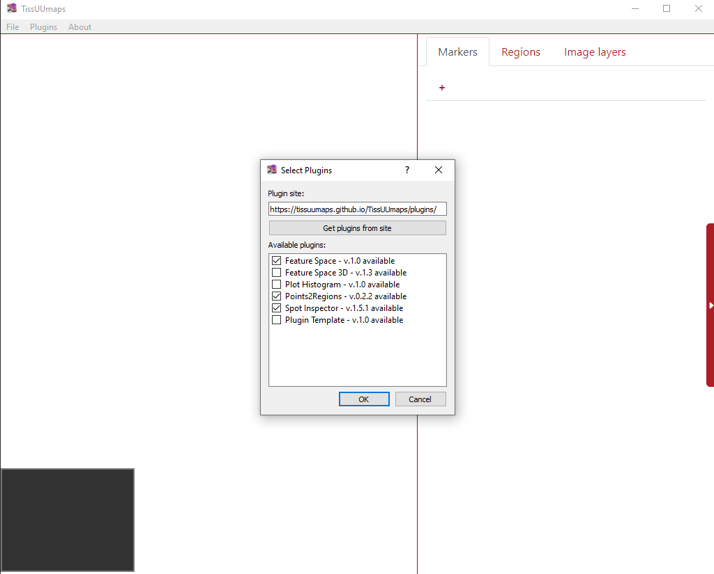
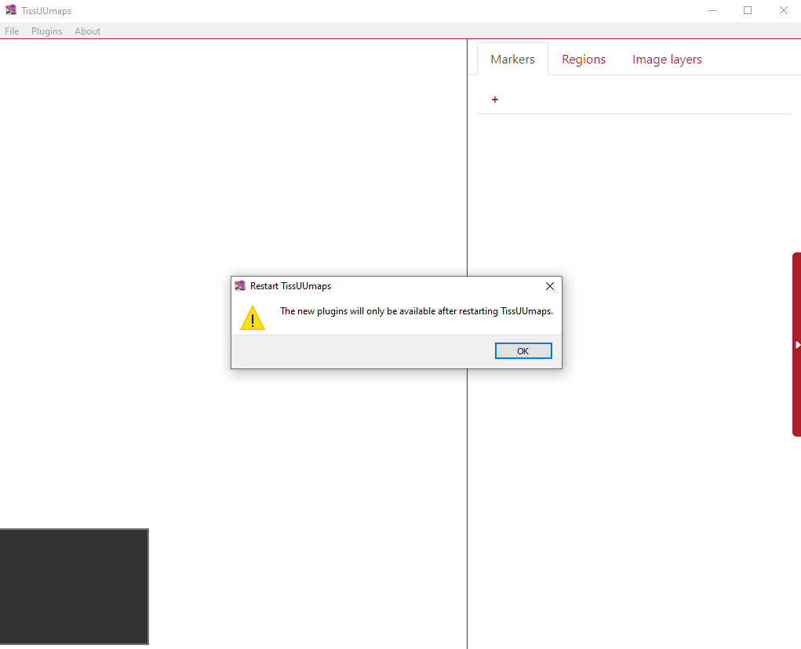
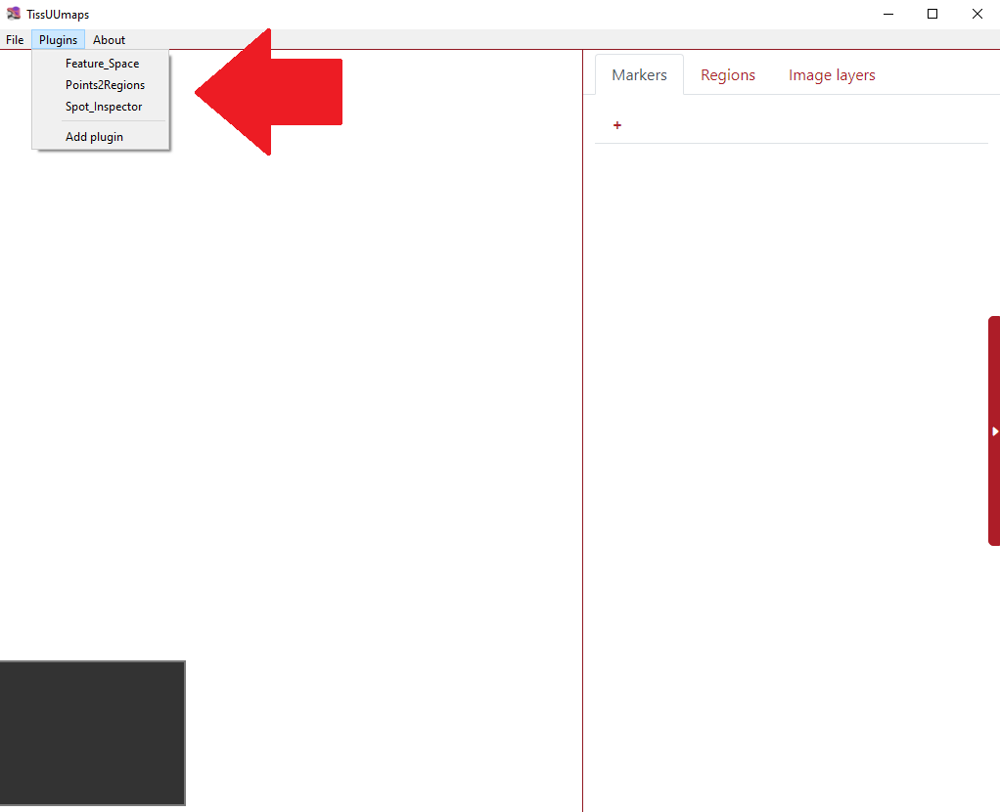
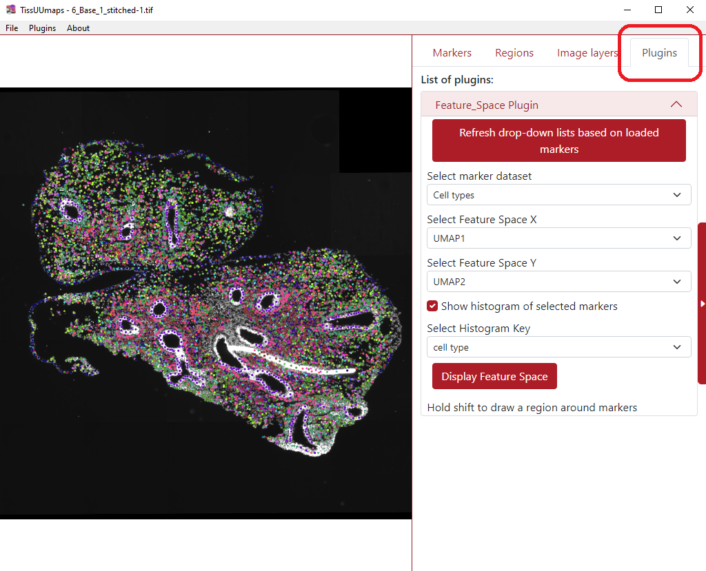

# Plugins

## Load plugins

In order to load plugins, first, they need to be installed. This can be done in the menu `Plugins > Add plugin` as can be seen in the example below.



Consequently, the user can check any number of plugins they desire and press *OK*.



Then the tool warns the user then the installed plugins will be available after restarting TissUUmaps.



After restarting the TissUUmaps, all the installed plugins are listed in the menu `Plugins` as you can see in the figure below.



Once the user selects any of the installed plugins (in the example below I selected *Feature_Space*), a new tab *Plugins* appears in the upper right part of the screen with all the required boxes for filling.




## Make your own plugin

Download the Plugin Template python and javascript files from the [Plugin Update Site](https://tissuumaps.github.io/TissUUmaps/plugins/) and put both files in your local folder `$USER_PATH/.tissuumaps/plugins/`. You can then change the plugin name and add your own options and functions.

### Javascript file

When loading a plugin, the function `PluginName.init(container)` will be called. The `container` is an html Element that will be added to the plugin menu. Use this element to add options and texts related to your plugin.


Here is a minimal example of plugin:

```javascript
var Plugin_template;
Plugin_template = {
    name:"Template Plugin"
}
 
/**
 * This method is called when the document is loaded.
 * The container element is a div where the plugin options will be displayed. */
Plugin_template.init = function (container) {
    container.innerHTML = "Hello world";
}
```

You can access the TissUUmaps javascript API [here](https://tissuumaps.github.io/TissUUmapsCore/).

### Python file

You only need to use the Python file if your plugin needs to do processing on the server side. For pure javascript plugins, you can leave this file empty.

The python file should implement the class `Plugin`:
```python
class Plugin ():
    def __init__(self, app):
        self.app = app
```
The `app` object being the flask application running the TissUUmaps server.

You can call a Python method inside the `Plugin` class from Javascript using Ajax and the Python API. The endpoint for a method `methodName` of the plugin `PluginName` will be: `/plugins/methodName/functionName`. Data can be transmitted through Ajax as stringified JSON, and will be available as a parameter inside the method.

See the Plugin Template for a working example of Javascript / Python communication.