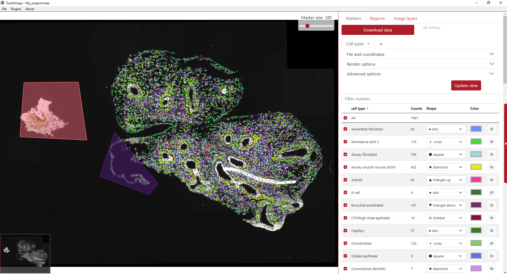

# Projects

## Saving projects

When the user has finished the visualization adjustments, region drawings, etc., the project is ready to be saved in order to continue working on it later or just basically to save it as it is for further consistency. The user needs to press *File* in the menu and then *Save project* or Ctrl + S.

In order to save the project together with the .csv file, it is necessary to generate a button first. The warning window below appears and the user needs to generate the button. The path to the .csv file needs to be relative to the path of the image. In this example, the image layer and the .csv file are in the exact same directory.

Then the user selects a suitable directory to save the project and writes the project file name, i.e. My_project.tmap, and the project is saved.

## Loading projects

The .tmap project can be loaded by two approaches. The first one is opening the TissUUmaps program, click *File* in the menu and then *Open* or Crtl + O. Then the user navigates in the directory and selects the .tmap file. By default, the directory navigates in the recent .tmap project.

The second option is directly double click on the .tmap file in file explorer in your computer.

After clicking the button *Download data*, both these approaches will lead to loading the project as can be seen in the example below.

For more information on the tmap file format and specifications, see {ref}`The TMAP file format`.

## Editing .tmap file manually

Work in progress

## Existing projects

### Human Developmental Lung Cell Atlas (pcw 5- pcw 14)

The human lung is a highly complex tubular organ, whose main function is the gas exchange between blood and breathed air. In contains a large number of specialized cell-types of epithelial, endothelial, neuronal, stromal and immune cells that are necessary for normal organ function and structural integrity. To understand how this cell heterogeneity develops to create a healthy mature lung, we focused on the 1st trimester of gestation and applied state of art technologies to capture the gene expression profiles of all the cells in the developing organ, in time and space.

**TissUUmaps interactive viewer**: \
<a href='https://tissuumaps.dckube.scilifelab.se/UMAP.tmap?path=private/HDCA/UMAP/' target="_blank" class="button">Single-cell RNA-sequencing</a> \
<small>UMAP representation of single-cell clusters and sub-clusters, gene expression and metadata.</small>

**In situ sequencing data (ISS) - TissUUmaps interactive viewer**: \
<a href='https://tissuumaps.dckube.scilifelab.se/05.tmap?path=private/HDCA/ISS/' target="_blank" class="button">pcw 5</a>  <a href='https://tissuumaps.dckube.scilifelab.se/06.tmap?path=private/HDCA/ISS/' target="_blank" class="button">pcw 6</a>  <a href='https://tissuumaps.dckube.scilifelab.se/13.tmap?path=private/HDCA/ISS/' target="_blank" class="button">pcw 13</a>\
<small>In situ sequencing data. Spot location + identity, per bin pie chart view of cell type probabilities and imputed genes.</small>

**SCRINSHOT data - TissUUmaps interactive viewer**: \
<a href='https://tissuumaps.dckube.scilifelab.se/pcw6.tmap?path=private/HDCA/SCRINSHOT/' target="_blank" class="button">pcw 6</a>  <a href='https://tissuumaps.dckube.scilifelab.se/pcw8.tmap?path=private/HDCA/SCRINSHOT/' target="_blank" class="button">pcw 8</a>  <a href='https://tissuumaps.dckube.scilifelab.se/pcw11.tmap?path=private/HDCA/SCRINSHOT/' target="_blank" class="button">pcw 11</a>  <a href='https://tissuumaps.dckube.scilifelab.se/pcw14.tmap?path=private/HDCA/SCRINSHOT/' target="_blank" class="button">pcw 14</a>\
<small>SCRINSHOT data. Spot location + identity.</small>

**Spatial Transcriptomics data - TissUUmaps interactive viewer**: \
<a href='https://tissuumaps.dckube.scilifelab.se/Counts_25.tmap?path=private/HDCA/ST/' target="_blank" class="button">pcw 6</a>  <a href='https://tissuumaps.dckube.scilifelab.se/Counts_29.tmap?path=private/HDCA/ST/' target="_blank" class="button">pcw 8</a>  <a href='https://tissuumaps.dckube.scilifelab.se/Counts_06.tmap?path=private/HDCA/ST/' target="_blank" class="button">pcw 10</a>  <a href='https://tissuumaps.dckube.scilifelab.se/Counts_23.tmap?path=private/HDCA/ST/' target="_blank" class="button">pcw 11</a>\
<small>Per gene or pie chart view of gene expression.</small>

More information is available in the original [publication](https://doi.org/10.1101/2022.01.11.475631): \
<small>A. Sountoulidis, S.M. Salas, E. Braun, C. Avenel, J. Bergenstråhle, M. Vicari, P. Czarnewski, J. Theelke, A. Liontos, X. Abalo, Ž. Andrusivová, M. Asp, X. Li, L. Hu, S. Sariyar, A.M. Casals, B. Ayoglu, A. Firsova, J. Michaëlsson, E. Lundberg, C. Wählby, E. Sundström, S. Linnarsson, J. Lundeberg, M. Nilsson, C. Samakovlis. Developmental origins of cell heterogeneity in the human lung. BioRxiv doi: <https://doi.org/10.1101/2022.01.11.475631></small>

### Modelling of cell-type signatures in the developmental human heart

With the emergence of high throughput single cell techniques, the understanding of cellular diversity in biologically complex processes has rapidly increased. The next step towards comprehension of e.g. key organs in the mammal development is to obtain spatiotemporal atlases of the cellular diversity. However, targeted cell typing approaches relying on existing single cell data achieve incomplete and biased maps that could mask the molecular and cellular heterogeneity present in a tissue slide. Here we applied spage2vec, a de novo approach to spatially resolve and characterize cellular diversity during human heart development. Data from the original in situ sequencing experiment as well as identified cell types can be viewed in TissUUmaps. 

**TissUUmaps interactive viewer**: 
<a href='https://tissuumaps.research.it.uu.se/demo_projects/viewer.php?tmap=human_heart' target="_blank" class="button">Human heart</a>

More information is available in the original [publication](https://doi.org/10.1101/2021.07.10.451822): \
<small>RS. Marco Salas, X. Yuan,  C. Sylven,  M. Nilsson,  C. Wählby and  G.Partel. De novo spatiotemporal modelling of cell-type signatures identifies novel cell populations in the developmental human heart. BioRxiv doi: <https://doi.org/10.1101/2021.07.10.451822></small>

### Automated identification of the mouse brain's spatial compartments from in situ sequencing data

Neuroanatomical compartments of the mouse brain are identified and outlined mainly based on manual annotations of samples using features related to tissue and cellular morphology, taking advantage of publicly available reference atlases. However, this task is challenging since sliced tissue sections are rarely perfectly parallel or angled with respect to sections in the reference atlas and organs from different individuals may vary in size and shape and requires manual annotation. Here, we show how in situ sequencing data combined with dimensionality reduction and unsupervised clustering can be used to identify spatial compartments that correspond to known anatomical compartments of the brain. Here we show results on four different sections of mouse brains.

**TissUUmaps interactive viewer**: 
<a href='https://tissuumaps.research.it.uu.se/demo_projects/viewer.php?tmap=mousebrain_5' target="_blank" class="button">Mouse brain</a>

More information is available in this [publication](https://doi.org/10.1186/s12915-020-00874-5): \
<small>G. Partel, M.M. Hilscher, G. Milli, L. Solorzano, A.H. Klemm, M. Nilsson, and C. Wählby.  Automated identification of the mouse brain’s spatial compartments from in situ sequencing data.  BMC Biology, <https://doi.org/10.1186/s12915-020-00874-5>, Oct 2020.</small>

The original raw ISS data was published in Qian, X., Harris, K. D., Hauling, T., Nicoloutsopoulos, D., Muñoz-Manchado, A. B., Skene, N., ... & Nilsson, M. (2020). Probabilistic cell typing enables fine mapping of closely related cell types in situ. [Nature methods](https://doi.org/10.1038/s41592-019-0631-4), 17(1), 101-106. 

Data and code availability: All software was developed in Python 3 using open source libraries, and data processing of pipeline workflows was carried out using [Anduril2](https://doi.org/10.1093/bioinformatics/btz133) analysis framework. The processing pipelines, data, and the software version used to generate the analysis results and figures presented in this paper are available at <https://doi.org/10.5281/zenodo.3928219> or from our github repository <https://github.com/wahlby-lab/graph-iss>. 

### Spage2vec: Unsupervised representation of localized spatial gene expression signatures

Spage2vec is an unsupervised segmentation free approach for decrypting the spatial transcriptomic heterogeneity of complex tissues at subcellular resolution. Spage2vec represents the spatial transcriptomic landscape of tissue samples as a graph and leverage powerful machine learning graph representation technique to create a lower dimensional representation of local spatial gene expression. Here we visualize spage2vec localized gene expression signatures of different spatial transcriptomic datasets. \
We thank Mats Nilsson, Sten Linnarsson and Xiaowei Zhuang for making their datasets publicly available.

**TissUUmaps interactive viewer 1**: \
<a href='https://tissuumaps.research.it.uu.se/demo_projects/viewer.php?tmap=Spage2vec_ISS_Qian_et_al' target="_blank" class="button">In situ sequencing mouse brain hippocampal area CA1</a> \
<small>Qian, X., Harris, K. D., Hauling, T., Nicoloutsopoulos, D., Muñoz-Manchado, A. B., Skene, N., ... & Nilsson, M. (2020). Probabilistic cell typing enables fine mapping of closely related cell types in situ. [Nature methods](https://doi.org/10.1038/s41592-019-0631-4), 17(1), 101-106.</small>

**TissUUmaps interactive viewer 2**: \
<a href='https://tissuumaps.research.it.uu.se/demo_projects/viewer.php?tmap=Spage2vec_osmFISH_Codeluppi_et_al' target="_blank" class="button">osmFISH mouse brain somatosensory cortex</a> \
<small>Codeluppi, S., Borm, L. E., Zeisel, A., La Manno, G., van Lunteren, J. A., Svensson, C. I., & Linnarsson, S. (2018). Spatial organization of the somatosensory cortex revealed by osmFISH. [Nature methods](https://doi.org/10.1038/s41592-018-0175-z), 15(11), 932-935.</small>

**TissUUmaps interactive viewer 3**: \
<a href='https://tissuumaps.research.it.uu.se/demo_projects/viewer.php?tmap=Spage2vec_MERFISH_Moffitt_et_al' target="_blank" class="button">MERFISH mouse brain hypothalamic preoptic area</a> \
<small>Moffitt, J. R., Bambah-Mukku, D., Eichhorn, S. W., Vaughn, E., Shekhar, K., Perez, J. D., ... & Zhuang, X. (2018). Molecular, spatial, and functional single-cell profiling of the hypothalamic preoptic region. [Science](https://doi.org/10.1126/science.aau5324), 362(6416), eaau5324.</small>

**TissUUmaps interactive viewer 4**: \
<a href='https://tissuumaps.research.it.uu.se/demo_projects/viewer.php?tmap=Spage2vec_MERFISH_Chen_et_al_2015' target="_blank" class="button">MERFISH human fibroblast cells (IMR90)</a> \
<small>Chen, K. H., Boettiger, A. N., Moffitt, J. R., Wang, S., & Zhuang, X. (2015). Spatially resolved, highly multiplexed RNA profiling in single cells. [Science](https://doi.org/10.1126/science.aaa6090), 348(6233), aaa6090.</small>

Data and code availability: Spatial gene expression data are available in Zenodo database at <https://doi.org/10.5281/zenodo.3897401>.
Source code for reproducing analysis results and figures is available in Zenodo database at <http://www.doi.org/10.5281/zenodo.4030404>.

### Artificial intelligence for diagnosis and grading of prostate cancer in biopsies: a population-based

An increasing volume of prostate biopsies and a worldwide shortage of urological pathologists puts a
strain on pathology departments. Additionally, the high intra-observer and inter-observer variability in grading can
result in overtreatment and undertreatment of prostate cancer. To alleviate these problems, we aimed to develop an
artificial intelligence (AI) system with clinically acceptable accuracy for prostate cancer detection, localisation, and
Gleason grading. Here we show examples of full-resolution digitized biopsies and corresponding AI-based grading.

An overview of all sample **datasets** can be found here: <a href='https://tissuumaps.research.it.uu.se/sthlm3/viewer.html?image=0&choice=0' target="_blank" class="button">Prostate cancer in biopsies</a> \
<small>

More information is available in this [publication](https://www.sciencedirect.com/science/article/pii/S1470204519307387): \
<small>P. Ström, K. Kartasalo, H. Olsson, L. Solorzano et al. Artificial intelligence for diagnosis and grading of prostate cancer in biopsies: a population-based, diagnostic study. The Lancet Oncology, Volume 21, Issue 2, 2020, Pages 222-232, ISSN 1470-2045,  doi: 10.1016/S1470-2045(19)30738-7, url: <https://www.sciencedirect.com/science/article/pii/S1470204519307387></small>

