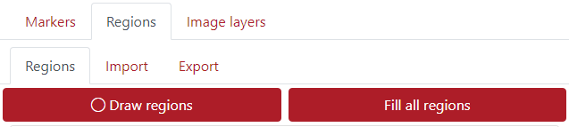
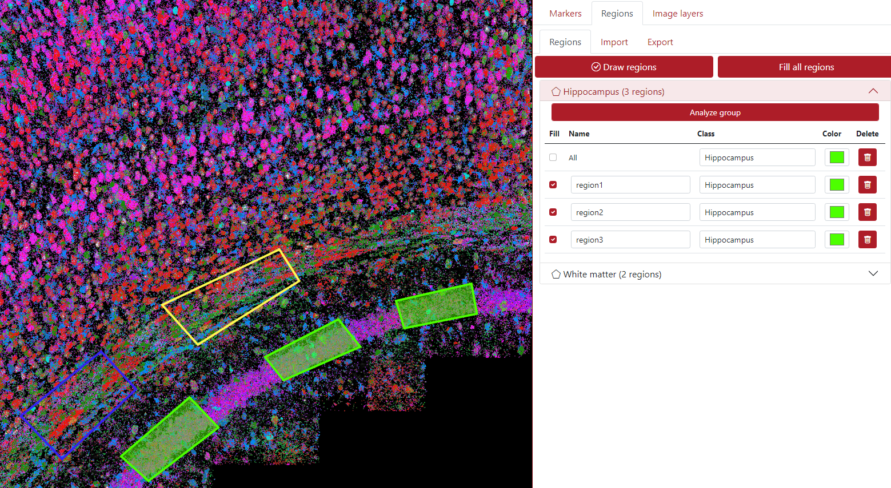
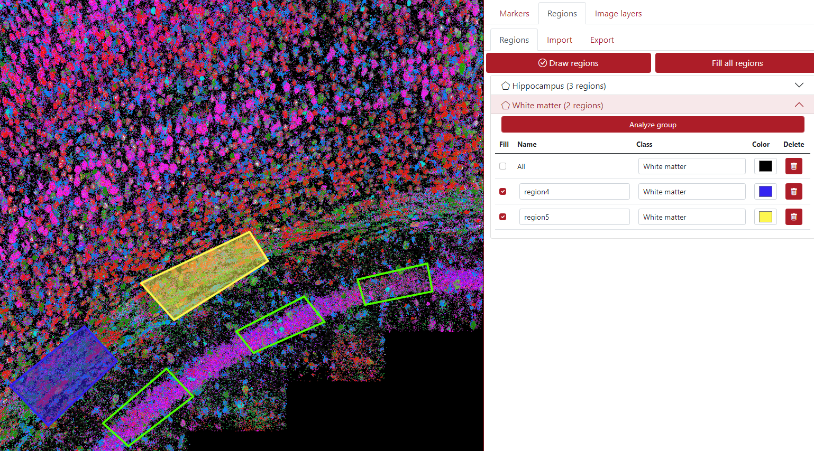

# Regions

## Supported region formats

TissUUmaps can read and write region files in the [GeoJSON](https://geojson.org/) format.

Only a subset of the GeoJSON format is supported, as TissUUmaps uses only polygonal regions:

__Main types__:
 * Feature
 * FeatureCollection
 * GeometryCollection

__Geometries__:
 * Polygon
 * Multipolygon

The coordinate system must be the same as the image and marker coordinate systems.

## Draw Regions

## Analyze Regions

## Load Regions

## Export Regions
