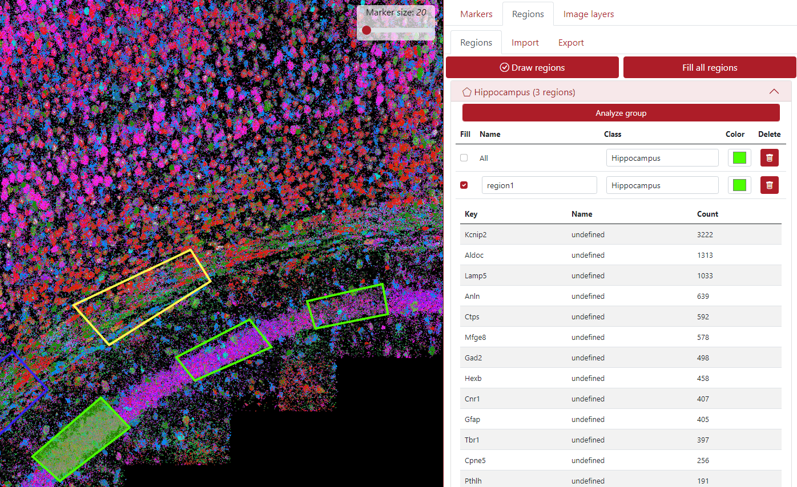

# Regions

## Supported region formats

TissUUmaps can read and write region files in the <a href="https://geojson.org/" target="_blank">GeoJSON</a> format.

Only a subset of the GeoJSON format is supported, as TissUUmaps uses only polygonal regions:

__Main types__:
 * Feature
 * FeatureCollection
 * GeometryCollection

__Geometries__:
 * Polygon
 * Multipolygon

The coordinate system must be the same as the image and marker coordinate systems.

## Draw Regions

Regions are polygons that can be drawn by the user or imported from an external file. If the user clicks on the button *Draw regions* shown underneath, the button is checked and the user can draw an unlimited number of regions. The user clicks on the image to outline the region of interest, then click on the first point to close the region and the region will appear in the right panel.

The button *Fill all regions* fills the inner part of all the regions by semitransparent color. This can be done separately by clicking on the check box next to individual regions.

In the example below are three drawn regions selecting the hippocampus areas, all set to green color. You can set the class name in the *Class* column. You can see that the drawn regions are categorized into two main groups Hippocampus and White matter. The user can create an unlimited number of groups depending on his interest. This helps to have the regions organized and also it is very useful when exporting regions.

In the example below are two drawn regions selecting the white matter areas, one is set to yellow and the other one to blue color. The regions are interchangeable between groups, so if you want to move a region from group Hippocampus to group White matter, just change the class name in the region's row and it will be automatically moved to the desired group.

## Analyze Regions

The regions can be analyzed, meaning displaying a list of all the marker keys with their counts inside that region (expression). The example below shows the analyzed region1. In this case, the analysis contains gene expression, so the column *Key* contains a list of genes, and column *Name* could show an additional column from the dataset, in this case, it is undefined since we provided only column Genes. The last column *Count* shows the number of each gene inside the analyzed region.

## Import Regions

Regions can be imported from .json file, which could be achieved from an external software or also from TissUUmaps' plugin *Points2Regions*. The user just click on the tab *Import* -> *Choose File* and press the button *Import*.

After that, the displayed regions appear in the left panel and the list of regions in the right panel as you can see in the example below. In this case, there are 10 different regions, called clusters. The user can change the color, the name, and the class of the regions if necessary. The user can as well draw some extra regions. These regions can be analyzed to observe the marker expression.

## Export Regions

The regions can be exported by clicking the tab *Export*, there the user can export two types of files. The first one is the .json file and the name can be selected. The second file is the marker expression in the regions which can be exported as .csv file (this is exported only if the regions were analyzed).

In the figure below can be seen an example of the exported .cvs file.

